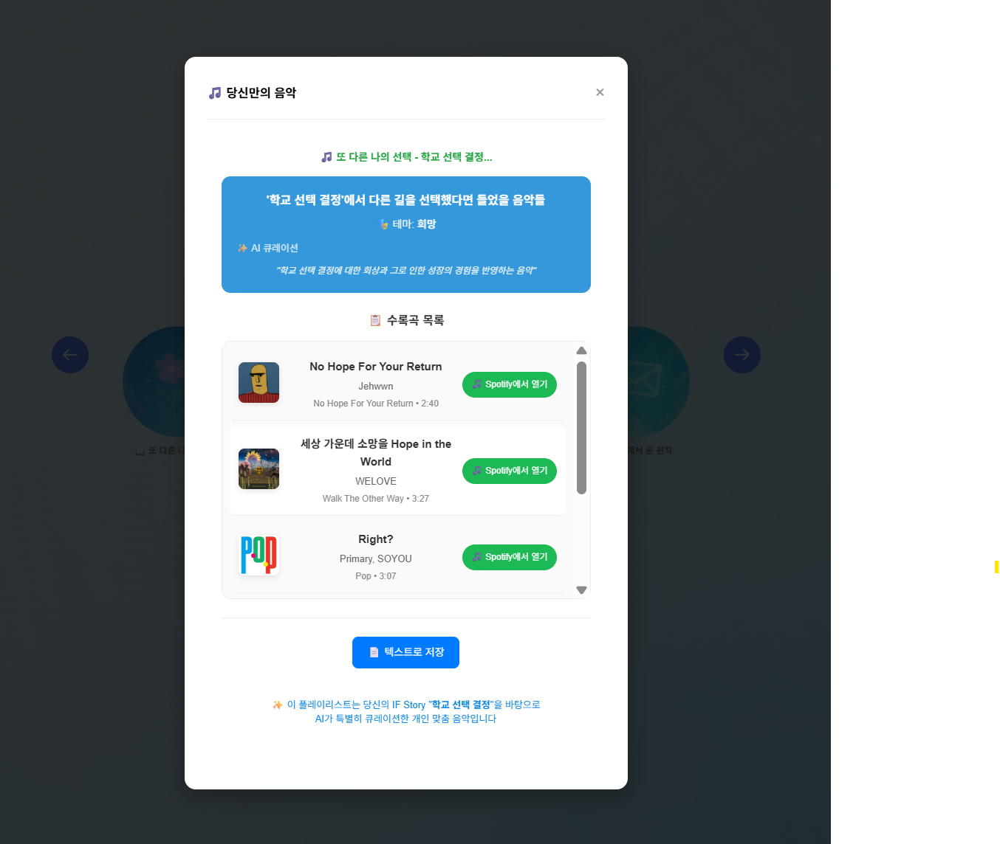

# MS_AI_2nd_project

# 프로젝트 기획 의도 
많은 사람들은 인생을 살아가며 자신의 선택을 때로는 아쉬워하며 다른 삶을 상상하고는 합니다.
그러나 그러한 상상을 구체화하여 이야기로 풀어볼 기회는 거의 없습니다.
AI가 이를 대신 정리해주고,감정적으로 회고하게 만들 수 있다면, 그것은 단순 기술을 넘어 자기 돌봄의 도구가 될 수 있습니다.

# 서비스 기능 및 흐름 
Step 1: 일상 감정 기록
AI 캐릭터와 사용자가 자연스럽게 대화를 나눌 수 있습니다.
"오늘 회의에서 기분이 어땠어?", "그때 왜 그런 선택을 했을까?" 같은 구체적인 질문들을 통해 사용자 감정뿐만 아니라. 그 감정을 만든 상황, 선택, 관계들까지 사용자가 선택한 AI가 심층적으로 분석합니다. 
- 10대 특화 기능: 연령대별 맞춤 질문 ("시험 스트레스는 어때?", "친구 관계에서 힘든 점이 있어?", "진로 고민이 있다면?")과 함께 RAG 모델을 통한 청소년 심리 상담에 특화된 깊이 있는 분석을 제공합니다.

Step 2: 인생 분기점 발견
축적된 대화에서 AI가 사용자의 중요한 인생 분기점들을 찾아냅니다
"3개월 전 이직 결정", "작년 연애 관계", 대학 전공 선택" 같은 터닝포인트들에 대하여 "그때 다른 선택을 했다면?" 이라는 질문을 적절한 타이밍에 제안 
- 10대 특화 기능: "문과/이과 선택", "친구 관계 갈등" 등 청소년기 특별한 선택의 순간들을 식별하고, RAG 모델에 저장된 청소년 상담 데이터를 바탕으로 전문적인 가이드를 제공합니다.

Step 3: 대안 인생 탐색
실제 선택과 다른 가능성들을 AI가 서사로 재구성합니다.
현재의 감정 상태와 과거 선택들 간의 연결고리를 발견하고 "지금의 나"를 더 깊이 이해하고 수용할 수 있게끔 도와줍니다. 
- 10대 특화 기능 : RAG 기반 전문 상담: 10대 사용자의 경우, 청소년 상담 데이터를 바탕으로 한 RAG 모델을 통해 단순한 대화를 넘어선 체계적이고 전문적인 상담을 제공합니다. 학업 스트레스, 또래 관계, 정체성 혼란, 진로 불안 등 청소년기 특유의 고민에 대해 심층적인 분석과 실질적인 해결방안을 제시합니다.

# 결과물 선택지
1)실제 삶과 대안 삶을 자서전 형식으로 비교 감상할 수 있는 자서전 
2)사용자의 현재 삶을 응원하는 타로 카드
3)사용자의 인생 분기점에서 느껴지는 감정을 바탕으로한 뮤직 플레이리스트
총 3개의 선택지를 통해 사용자를 위한 다양한 위로와 공감이 이루어집니다. 

# 프로젝트 화면
아래는 프로젝트 주요 화면입니다.

# 추후 업그레이드 방향
[캐릭터 & 브랜드 협업]
  - 캐릭터 커스터마이징: IP 제휴, 연예인 음성 스킨 적용 가능
  - 브랜드 콜라보: "오늘의 00카페 위로 메시지", "광고형 대화 챕터"

[교육 및 정신건강 분야 활용]
  - 청소년 타겟팅으로 진로 상담 및 정신건강 지킴이 역할
    - RAG 모델 기반 전문 상담: 청소년 심리학, 상담학 전문 지식을 활용한 심층적 상담 서비스
    - 위기 상황 조기 발견: 우울, 자해, 학교폭력 등 위험 신호 감지 및 전문기관 연계

  - 학교 활용: 학생 상담 및 감정 관리 도구로 교육기관 도입 가능, NICE 연계 등
    교사와 상담교사를 위한 학생 이해 리포트 제공
    개별 학생 맞춤형 상담 가이드라인 생성

  - B2B 적용: 기업 복지용, 정신건강 기관 협업 서비스 패키지 구성
    청소년 상담센터, 정신건강복지센터와의 전문적 협업 모델 구축
